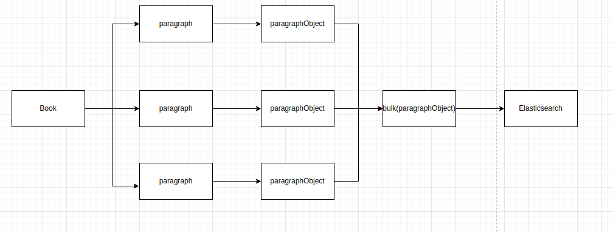
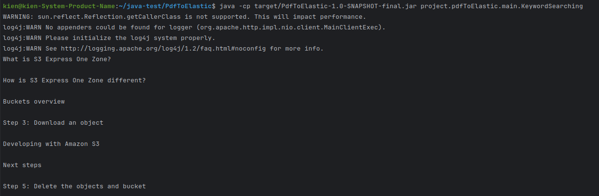

# PDF to Elastic

Project này có mục tiêu extract file PDF (sách) và đẩy vào elasticsearch phục vụ công việc searching

Có 2 công việc chính trong project này:

1) Crawl document to elasticsearch

2) Query elasticsearch by keyword

# Database

Thông tin cụm elasticsearch và kibana

version: `7.15.1`

elasticsearch: `localhost:9200`

kibana: localhost: `localhost:5601`

index: `pdf_to_document`

Trước khi bắt đầu chạy code, nhớ tạo index và mapping cho elasticsearch để giúp việc insert diễn ra chuẩn xác và thuận lợi.

```jsx
PUT /pdf_to_document
{
  "settings": {
    "number_of_shards": 1,
    "number_of_replicas": 1
  },
  "mappings": {
    "properties": {
      "documentID": {
        "type": "keyword"
      },
      "startPageNumber": {
        "type": "integer"
      },
      "headerLineNumber": {
        "type": "integer"
      },
      "endPageNumber": {
        "type": "integer"
      },
      "headerName": {
        "type": "text"
      },
      "paragraphContent": {
        "type": "text"
      }
    }
  }
}
```

# 1) PDF Document to Elasticsearch

**Ý tưởng**

Dựa vào cấu trúc đoạn văn bản, cắt nhỏ ra và xử lý phân tán, sau đó collect về một nơi và đẩy bulk vào elasticsearch



### Các vấn đề cần giải quyết

**Đọc và cắt file như thế nào?**

Đầu tiên ta dựa vào table of content để extract ra list các header và page, các thông tin cần lấy bao gồm:

- Start page: Trang mà chứa Vị trí bắt đầu đoạn văn bản (Vị trí header hiện tại)
- End page: Trang mà chứa vị trí kết thúc đoạn văn bản (vị trí header tiếp theo)

Ví dụ đoạn văn bản được xác định từ trang 5 tới trang 7

Tiếp tục cắt từ trang 5 tới trang 7

xác định index của header và next header

Cắt đoạn văn bản giữa 2 index và đây là output cuối cùng

**Làm sao để phân biệt header với các đoạn text bình thường ?**

Các header có đặc điểm là sẽ có “\n” ở bên cạnh, vì vậy có thể tìm dựa trên đặc điểm này

Trường hợp đoạn text thường có “\n” chưa thể xử lý, nhưng khảo sát random thì trường hợp này gần như không xảy ra.

### Triển khai

Download source code

```jsx
git clone git@github.com:dotrungkien3210/techx_exam.git
cd java-test/PdfToElastic
```

Chạy câu lệnh khởi động docker chứa elasticsearch và kibana

```jsx
docker compose -f 7.15.1_es_kibana.yml up -d
```

Kiểm tra xem docker đã khởi động thành công chưa


Build package

```jsx
mvn clean install
```


Chạy job insert

```jsx
java -cp target/PdfToElastic-1.0-SNAPSHOT-final.jar project.pdfToElastic.main.PDFToElastic
```


Kết quả Trong elasticsearch

```jsx
GET pdf_to_document/_search
{
    "query": {
        "match_all": {}
    }
}
```


# 2) Keyword Query

**Ý tưởng**

Dựa vào list keyword input vào, tiến hành generate query từ list keyword đó và gửi request tới elasticsearch

Định nghĩ văn bản ở đây sẽ có header và content

query này hướng tới việc searching keyword input vào trong header và content, nếu như trùng ít nhất 1 trong 2 thì sẽ được cho là match

Đầu tiên đưa list keyword cần vào trong file `input/input.txt`


Build package

```jsx
mvn clean install
```

Chạy job query

```jsx
java -cp target/PdfToElastic-1.0-SNAPSHOT-final.jar project.pdfToElastic.main.KeywordSearching
```

Kết quả trả về sẽ là header những bản ghi thỏa mãn



# Problems

Một số khó khăn chưa giải quyết được

1) đánh số trang sai dẫn đến việc cào thất bại


2) chưa phân cấp được các header

Một số phương án đề ra như check thụt dòng, check tọa độ, check in đậm nhưng hiện nay chưa có thử nghiệm nào thành công